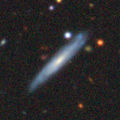
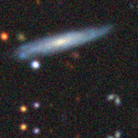
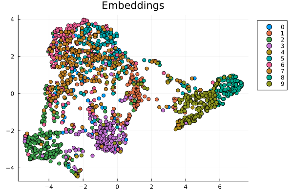
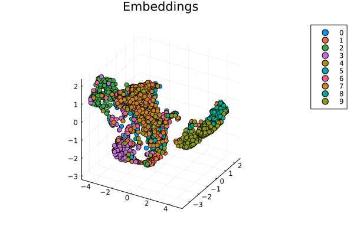

# CNN for Galaxy Classification with Metric Learning

Project Course: **B0B36JUL**

This project implements a **convolutional neural network (CNN)** for galaxy image classification
using the **Galaxy10 DECals dataset**.  
In addition to standard classification, the model learns an **embedding space** using metric learning,
allowing similar galaxy morphologies to cluster together.

The project is implemented in **Julia**.

---

## Overview

The goal of this project is to explore deep learning techniques for galaxy morphology classification.
Instead of relying solely on classification accuracy, the model is trained to produce meaningful
embeddings using metric learning, which can be used for visualization, clustering, or similarity search.

---

## Features

- CNN-based image classification
- Metric learning in the embedding space
- Galaxy10 DECals dataset support
- Dataset splitting and augmentation
- Training and evaluation
- Image and embedding visualisations

---


## Project Structure

```
.
├── data/ # Dataset and dataset preparation
│ └── README.md # Dataset download & preprocessing instructions
├── pictures/
│   ├── original.png
│   ├── augmented.png
│   ├── embeddings_2d.png
│   └── embeddings_3d.png
├── src/ # Source code
│ ├── GalaxyCNN.jl # Main module
│ ├── augmentation/ # Data augmentation methods
│ │ ├── augment.jl
│ │ ├── noise.jl
│ │ ├── rotation.jl
│ │ ├── translation.jl
│ │ └── zoom.jl
│ ├── dataset_creation/ # Dataset loading and splitting
│ │ ├── galaxies_split.jl
│ │ ├── load_galaxy.jl
│ │ └── save_augmented.jl
│ ├── batches.jl
│ ├── cnn.jl # CNN architecture definition
│ ├── hybrid_model.jl # CNN + metric learning hybrid model
│ ├── metric.jl # Metric learning loss and utilities
│ ├── dataset_loading.jl # Dataset loading utilities
│ ├── model_save_load.jl # Model saving and loading
│ ├── show_image.jl # Image visualization helpers
│ └── visualisation.jl # Embedding visualizations
├── examples/ # Example experiments
├── test/ # Tests
├── Project.toml
├── Manifest.toml
└── README.md
```

---

## Dataset

This project uses the **Galaxy10 DECals** dataset containing galaxy images
classified into 10 morphological categories.

Due to its size, the dataset is **not included** in the repository.

📁 Dataset preparation instructions can be found in  
[`data/README.md`](data/README.md)

---

## Results

The trained model achieves a **classification accuracy exceeding 70 %**
on the held-out test set of the Galaxy10 DECals dataset.

This demonstrates that the proposed CNN architecture combined with metric learning
is capable of learning meaningful representations of galaxy morphologies.

---

## Installation

### Clone the repository

```bash
git clone https://github.com/B0B36JUL-FinalProjects-2025/Project_burdaja3.git GalaxyCNN
```

### Open Julia

```bash
julia
```

### Add the package to an environment

```julia
using Pkg
Pkg.add(url="https://github.com/B0B36JUL-FinalProjects-2025/Project_burdaja3.git")
```

### Use the package

```julia
using GalaxyCNN
```

## Usage Examples

Check the folder examples/ for example functions.

### Data Augmentation Example

This example demonstrates how to apply augmentation to a test image
and visualize the result.  

```julia
using GalaxyCNN

path = "data/test"

imgs, labels = load_test(path)

idx = rand(1:size(imgs, 4))

img = float32.(imgs[:,:,:,idx]) / 255

augmented = similar(img)

augment!(augmented, img)

show_image(img)
show_image(augmented)
```




### Prediction Example

This example demonstrates how to run a prediction using a pretrained hybrid CNN + metric learning model,
compute accuracy, and visualize embeddings in 2D and 3D.

```julia
using Statistics: mean
using GalaxyCNN

path_dataset = "data/test"
path_model = "model/cnn_metric.bson"

model = get_default_hybrid_model()
load_model!(path_model, model)

imgs, labels = load_test(path_dataset)

imgs = (Float32.(imgs)) ./ 255f0

embs = get_embs(model, imgs)
pred = get_class(model, imgs)

acc = mean(pred .== labels)

visualise2D(embs, labels)
visualise3D(embs, labels)
```




### Training Example

This example demonstrates how to train the hybrid CNN + metric learning model
on the Galaxy10 DECals dataset, optionally with data augmentation, and save the trained model.

```julia
using GalaxyCNN

# Train the model with default settings
train_model(
    augment=true,         # apply data augmentation
    batches=2000,         # number of training iterations
    block_size=16,        # batch size = block_size * number of classes
    alpha=0.7f0,          # weight of metric loss
    save_path="model/cnn_metric.bson",  # where to save the model
    resume=true           # resume from checkpoint if exists
)
```